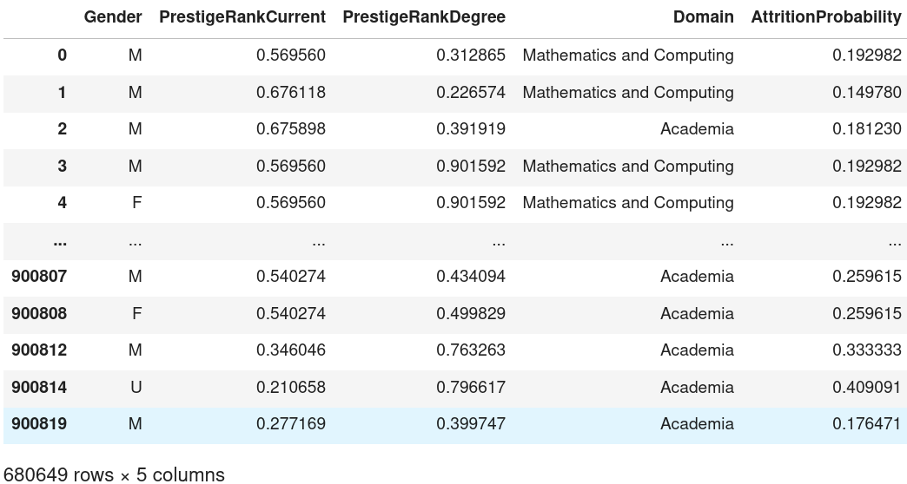
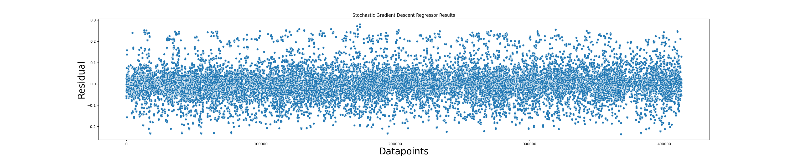
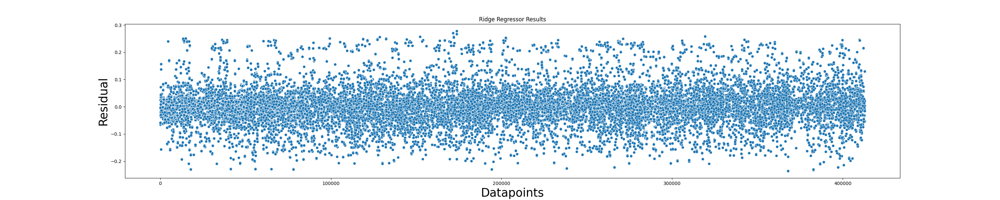
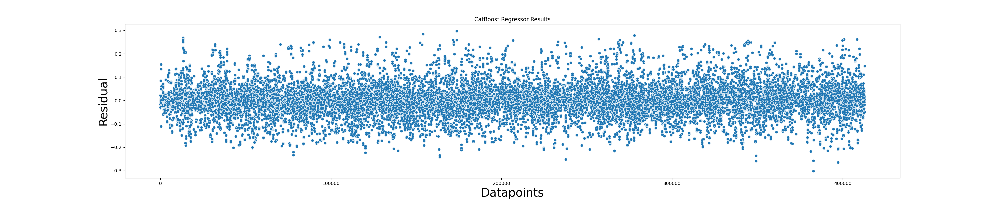
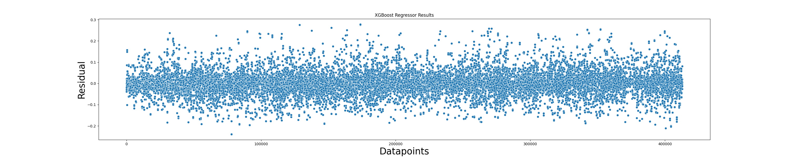
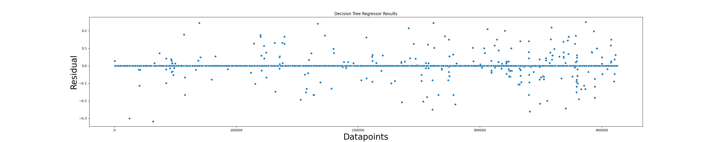
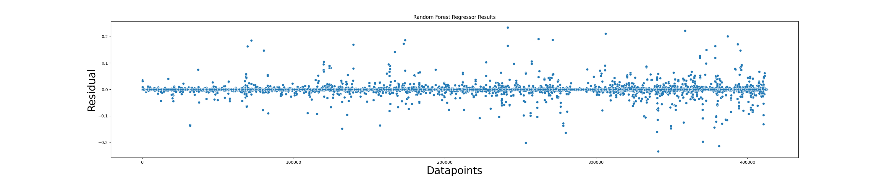

# US Faculty Employment Potential
### Quantifying hiring bias for tenure-track faculty employments
### Project Checkpoint 2
##### 25 November 2022
##### Machine Learning Ninjas: Bhatia, Ghosh, Nwogu

---

## Outline
- Preliminary ML Pipeline
- Final ML Pipeline
- ML Pipeline - Input
- ML Modelling and Results
- Potential Issues
- Potential Improved Methods for Enhanced Performance
- Future Plan


---

## Preliminary ML Pipeline 

`$$AttritionProbability = \frac{AttritionEvents}{AttritionEvents + NonAttritionEvents}$$`


Notes:

- The initial goal was to obtain `AttritionProbability` as the output from the ML Algortihm. This variable represents what a professor's succes is defined by. A lower `AttritionProbability` is the predictor label that indicates greater/higher success while a lower value indicates otherwise.  This is still our goal.

- Our initial plan was to combine EdgeList and InstitutionStats into a new input dataframe with eight features.  Each row contained data from multiple professors and our initial plan was to use `Total` number of professors as the weight for each data point.  However, since the male and female breakdown numbers were scattered in separate fields, we could not just apply weights to each data point.  It would have really complicated our pipeline.

- So instead of that, we exploded the data points with a new categorical field `Gender`.  We also dropped several features.

---


## Final ML Pipeline


Notes:

EdgeList contains aggregated data of all professors grouped by their source instutition, current institution, and specific domain or field.  Number of professors per row is indicated by the `Total` column further broken down into two `Gender` columns.  We disaggregate this data by exploding the rows.  Then we left join this dataframe with CurrentInstitutionStats and DegreeInstitutionStats to get `ResearcherData`.  `ResearcherData` is then fed through an SVD algorithm to train a model to predict `AttritionProbability`.

---

## Input

- The input for the final ML pipeline includes: 
    - Gender
    - PrestigeRankCurrent
    - PrestigeRankDegree
    - Domain
    - AttritionProbability


Notes:
The input data utilized in our final ML pipeline are
- Gender: This is a String. It represents The gender of a faculty member
- PrestigeRankCurrent: This is a Float. The SpringRank of the academic institution where the faculty is employed, scaled from 0-1. A rank of 0 indicates high prestige, a rank of 1 indicates low prestige
- PrestigeRankDegree: This is a Float. The SpringRank of the academic institution that produced the faculty, scaled from 0-1. A rank of 0 indicates high prestige, a rank of 1 indicates low prestige
- Domain: This reresents the academic domain of a faculty member
- AttritionProbability: This is a Float. It represents the probability of attrition for a given faculty member

--




```
    Int64Index: 680649 entries, 0 to 900819
    Data columns (total 5 columns):
    #   Column                Non-Null Count   Dtype   
    ---  ------                --------------   -----   
    0   Gender                680649 non-null  category
    1   PrestigeRankCurrent   680649 non-null  float64 
    2   PrestigeRankDegree    680649 non-null  float64 
    3   Domain                680649 non-null  category
    4   AttritionProbability  680649 non-null  float64 
    dtypes: category(2), float64(3)
    memory usage: 22.1 MB
```

## Metrics
- Accuracy
    - Measures model accuracy

- Mean Squared Error (MSE)
    - Measures the amount of error in the model 
    - Average squared difference between observed and predicted values

- R-squared
    - Goodness-of-fit metric 
    - Percentage of the variance in the dependent variable that the independent variables explain collectively

Notes:
 
--

## ML Modelling 
- Regression Analysis
    - Continuous prediction target variable
    - Nature of project 
    - Machine Learning Pipeline
- Regressor Models:
    - Decision Tree Regressor
    - Random Forest Regressor
    - Stochastic Gradient Descent Regressor
    - Catboost Regressor
    - XGBoost Regressor
    - Lasso Regressor 
    - Ridge Regressor


Notes:
The variable we are trying to predict is a continuous one, which makes regression analysis the efficient modelling algorithm to use. Also, due to the nature of the project, specifically using a set of independent variables to predict a dependent variable (AttritionProbability), the best type of analysis is regression. This is also reflected in the ML Pipeline
 
--

### Stochastic Gradient Descent Regressor
- Used with a `max_iter` value of 10000000
- Used with an `tol` value of 1e-10

```
SGD = make_pipeline(StandardScaler(),SGDRegressor(max_iter=10000000, tol=1e-10))
SGD.fit(train_X,train_Y)
pred_Y = SGD.predict(test_X)
accuracy_SGD = round(SGD.score(train_X, train_Y) * 100, 2)
accuracy_SGD, mean_squared_error(test_Y, pred_Y), r2_score(test_Y, pred_Y)
```

Notes:
 
--

### Stochastic Gradient Descent Regressor - Results
- Accuracy: 14.53

- Mean Squared Error (MSE): 0.0031783664239967953

- R-squared: 0.15377511450664805



Notes:
 
--

### Lasso Regressor

- Used with a `alpha` value of 0.0001

```
lasso = linear_model.Lasso(alpha=0.0001)
lasso.fit(train_X,train_Y)
pred_Y = lasso.predict(test_X)
accuracy_lasso = round(lasso.score(train_X, train_Y) * 100, 2)
accuracy_lasso, mean_squared_error(test_Y, pred_Y), r2_score(test_Y, pred_Y)
```

Notes:
 
--

### Lasso Regressor - Results
- Accuracy: 14.65

- Mean Squared Error (MSE): 0.0031764477499716427

- R-squared: 0.15428595230526543


Notes:
 
--

### Ridge Regressor

- Used with a `alpha` value of 0.01

```
ridge = Ridge(alpha=.01)
ridge.fit(train_X,train_Y)
pred_Y = ridge.predict(test_X)
accuracy_ridge = round(ridge.score(train_X, train_Y) * 100, 2)
accuracy_ridge, mean_squared_error(test_Y, pred_Y), r2_score(test_Y, pred_Y)
```

Notes:
 
--

### Ridge Regressor - Results
- Accuracy: 14.69

- Mean Squared Error (MSE): 0.003174582604292563

- R-squared: 0.15478253843730827



Notes:
 
---

### Catboost Regressor
- Used with a `verbose` value of 0

```
catboost = CatBoostRegressor(verbose=0)
catboost.fit(train_X,train_Y)
pred_Y = catboost.predict(test_X)
accuracy_catboost = round(catboost.score(train_X, train_Y) * 100, 2)
accuracy_catboost, mean_squared_error(test_Y, pred_Y), r2_score(test_Y, pred_Y)
```

Notes:
 
--

### Catboost Regressor Results
- Accuracy: 38.5

- Mean Squared Error (MSE): 0.00235755390490074

- R-squared: 0.3723125288020457



Notes:
 
--

### XGBoost Regressor

```
xgboost = XGBRegressor()
xgboost.fit(train_X,train_Y)
pred_Y = xgboost.predict(test_X)
accuracy_xgboost = round(xgboost.score(train_X, train_Y) * 100, 2)
accuracy_xgboost, mean_squared_error(test_Y, pred_Y), r2_score(test_Y, pred_Y)
```

Notes:
 
--

### XGBoost Regressor Results
- Accuracy: 56.0

- Mean Squared Error (MSE): 0.0017033830717451874

- R-squared: 0.5464823898352575



Notes:
 
--

### Decision Tree Regressor
- Used with a `random_state` value of 42

```
DT = DecisionTreeRegressor(random_state=42)
DT.fit(train_X,train_Y)
pred_Y = DT.predict(test_X)
accuracy_DT = round(DT.score(train_X, train_Y) * 100, 2)
accuracy_DT, mean_squared_error(test_Y, pred_Y), r2_score(test_Y, pred_Y)
```


Notes:
 
--

### Decision Tree Regressor - Results

- Accuracy: 99.93

- Mean Squared Error (MSE): 7.477459511247769e-05

- R-squared: 0.9800916210575562



Notes:
 
--

### Random Forest Regressor
- Used with a `random_state` value of 42
- Used with an `n_jobs` value of -1

```
RF = RandomForestRegressor(random_state=42, n_jobs=-1)
RF.fit(train_X,train_Y)
pred_Y = RF.predict(test_X)
accuracy_RF = round(RF.score(train_X, train_Y) * 100, 2)
accuracy_RF, mean_squared_error(test_Y, pred_Y), r2_score(test_Y, pred_Y)
```

Notes:
 
--

### Random Forest Regressor - Results

- Accuracy: 99.84

- Mean Squared Error (MSE): 6.074051620977429e-05

- R-squared: 0.9838281275606393



Notes:
 
--

## Modelling Results Summary

- Decision Tree and Random Forest regressors had highest accuracy values
- Lasso, Ridge, and Stochastic Gradient Descent regrssors had lowest accuracy values
- Catboost and XGBoost had average accuracy values

Notes:
 
---

## Model Improvement Method

### OneHot Encoding - `Gender` category
- Some models required OneHot encoding
- Others (e.g. CatBoost) handle it internally
 
### Weighted Data Points
-  `Count` as the weight for each data point

Notes:
 
---

## Issues

- CatBoost and XGBoost work well with unbalanced data
- Some models prefer categorical data and handle One Hot Encoding internally

Notes:


---

## Future Improvements

- No access to original data
- Not enough information to derive appropriate correlations - e.g. publications, citations

- Code cleanup / optimization, e.g.
```py
EdgeList['Gender'] = EdgeList.apply(lambda x: int(x['GenderUnknown'])*['U']+int(x['Men'])*['M']+int(x['Women'])*['F'], axis=1)
```

- Compute PrestigeRank: Calculate (PrestigeRank, AttritionEvents, NonAttritionEvents) from other data points within the same field/domain weighted by AttritionEvents + NonAttritionEvents.  If none of that is present, consider calculating from remaining data points.

Notes:


---

 ## Lessons Learned


Notes:Exploding across Gender will make a lot of identical rows
Some of these rows will be identical across train_df and test_df if we split it beforehand.
So, we split it into train_df and test_df first after all the feature engineering.

And then we explode the aggregated data to make sure that there are no data point repeats between the training dataset and testing dataset


Catboost and xgboost work much better for unbalanced data. Also, catboost does not work well for one-hot encoded data, however in this case, Gender information is important, so we have to one-hot encode it, to make interpretations.

Regarding regression models, Random Forest works the best. After 10 fold cross validation, we get an accuracy 98.01% without any overfitting issues.

For regression models, residual plots make sense, because visualizing the residuals help us see the how well our model performed.


<a style='text-decoration:none;line-height:16px;display:flex;color:#5B5B62;padding:10px;justify-content:end;' href='https://deepnote.com?utm_source=created-in-deepnote-cell&projectId=0fa8eae6-cbdb-42f3-8c8f-0479a8e45918' target="_blank">
 </img>
Created in <span style='font-weight:600;margin-left:4px;'>Deepnote</span></a>
